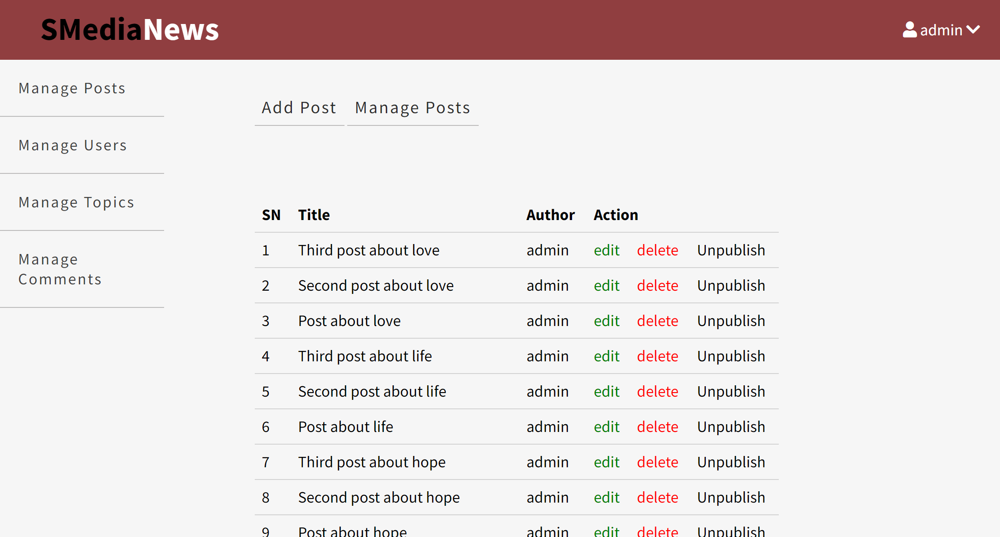

### SMediaNews
_____

SMediaNews is a blog website, built with procedural PHP and MySQL database. It contains a blog section where users can read and comment posts and an Admin dashboard that monitors the blog posts, topics, comments and users.

____

### Getting Started
- Download or Clone the project
- Import the SQL file (blog.sql) into the MySQL database
    - Open MySQL Workbench.
    - Go to Management - Data Import/Restore or Server - Data Import.
    - The blog.sql file already contains the SQL command to create database named ***blog***. 
    - Choose the option Import from Self-Contained File and select the file.
    - Select the option - Dump Structure and Data -
    - Click on Start Import.
- Set your database credentials in ***app/database/connect.php*** file
- Run the project in your local server
    - ***path.db*** contains root domain name of the application
- Use the testing credentials to login to Admin Dashboard
    - username: admin
    - password: admin123
___
- *Main Page*

- *Admin Dashboard*

_____

